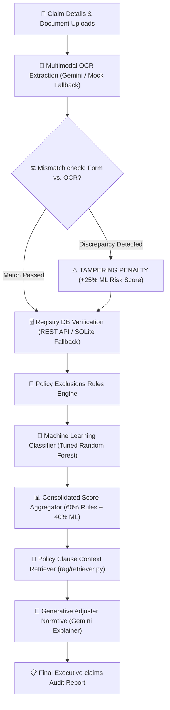

# ShieldAI: Enterprise-Grade Insurance Fraud Detection & Intelligence Audit System

ShieldAI is a production-grade, multi-domain claims verification and fraud detection platform. The system is designed to simulate a modern insurance ecosystem, leveraging a decoupled microservices architecture (FastAPI REST backend), isolated databases, cost-sensitive machine learning classification, and LLM-powered Retrieval-Augmented Generation (RAG) claims auditing.

---

## 🚀 System Architecture

ShieldAI is split into isolated layers to prevent database congestion, decouple business logic from storage, and enable resilient offline capability:

```mermaid
graph TD
    User["👤 Claimant / Underwriter UI (Streamlit)"]
    APIClient["🔌 API Client Wrapper (services/api_client.py)"]
    FastAPI["🏢 REST API Service (FastAPI - api/main.py)"]
    
    sub_insurance["🏢 Insurance DB (insurance_company.db)"]
    sub_motor["🚗 RTO Registry DB (motor_registry.db)"]
    sub_medical["🏥 Medical Registry DB (medical_registry.db)"]
    sub_death["👤 National Death DB (death_registry.db)"]
    sub_credit["💳 Credit Bureau DB (credit_registry.db)"]

    User -->|Queries & Registrations| APIClient
    
    APIClient -->|1. Try HTTP REST REST Calls (Port 8000)| FastAPI
    APIClient -.->|2. Fallback direct SQLite Connections| sub_insurance
    APIClient -.->|2. Fallback direct SQLite Connections| sub_motor
    APIClient -.->|2. Fallback direct SQLite Connections| sub_medical
    APIClient -.->|2. Fallback direct SQLite Connections| sub_death
    APIClient -.->|2. Fallback direct SQLite Connections| sub_credit
    
    FastAPI --> sub_insurance
    FastAPI --> sub_motor
    FastAPI --> sub_medical
    FastAPI --> sub_death
    FastAPI --> sub_credit
```

---

## 🔍 Claims Audit Pipeline

Every claim lifecycle executes a series of real-time programmatic audits:



---

## 🗄️ Isolated Registry Schemas

ShieldAI rejects monolithic data structures. Registry data is physically separated across **5 independent SQLite databases** representing distinct authority registries:

1. **`insurance_company.db`**: Stores central policy details, customer demographic profiles (`policyholders`), and the historic transaction ledger (`claims_log`).
2. **`medical_registry.db`**: Stores credential statuses for medical practitioners (`doctor_registry`) and hospital network flags (`hospital_registry`).
3. **`motor_registry.db`**: Represents RTO/Vahan registry for vehicle registration verification and traffic logs (`police_reports`).
4. **`death_registry.db`**: Represents the official death certificate directory to check life insurance exclusions.
5. **`credit_registry.db`**: Represents the Credit Bureau database housing outstanding loan agreements.

---

## 🧠 Machine Learning Pipeline (Rigor & Methodology)

Real-world fraud datasets are highly imbalanced. ShieldAI addresses this using rigorous, cost-sensitive machine learning best practices:

### 1. Imbalance Management & Anomaly Modeling
* **Realistic Anomaly Distributions:** Features are generated with log-normal and low-incidence patterns matching industry standards (e.g. non-network visits represent 10% of cases, loan-to-income mismatch is 5% common, frequent claims are 2% common).
* **Target Class Ratio:** Yields a natural **5.06% fraud imbalance rate** in [generate_dataset.py](file:///e:/Adarsh/Projects/Insurance%20Fraud%20detection/training/generate_dataset.py) without manual label flipping, preserving clean predictive features and preventing artificial label noise.
* **Feature Leakage Prevention:** Features are strictly preprocessed and scaled using column-specific logic *after* training splits, preventing data contamination.

### 2. Cost-Sensitive Model Training & Overfitting Validation
We trained three models, comparing performance on **both** the Training Set and the **unseen Test Set (20% split)** to prove generalization:

| Model Candidate | Split | Accuracy | Precision | Recall | F1-Score | ROC-AUC | Generalization Status |
| :--- | :--- | :--- | :--- | :--- | :--- | :--- | :--- |
| **Logistic Regression (Balanced)** | Train | 81.25% | 23.67% | 87.80% | 37.29% | 0.8795 | Excellent Fit (Train/Test F1 Gap: 0.010) |
| | Test | 82.00% | 24.45% | 88.89% | 38.36% | 0.9093 | |
| **Random Forest (Balanced, Tuned)** | Train | 95.67% | 60.52% | 91.73% | 72.93% | 0.9774 | **Champion Model** (High F1 & Recall, Gap: 0.10) |
| | Test | 97.70% | 75.64% | 93.65% | **83.69%** | **0.9850** | |
| **Gradient Boosting (Weighted)** | Train | 95.90% | 61.08% | 97.64% | 75.15% | 0.9895 | Excellent Fit (Train/Test F1 Gap: 0.001) |
| | Test | 96.40% | 66.27% | 87.30% | 75.34% | 0.9723 | |

* **Champion Selection:** The **Tuned Random Forest Classifier** (depth constraint = 7, min samples leaf = 4) was selected based on its superior **Test F1-Score (83.69%)** and saved to [models/fraud_model.pkl](file:///e:/Adarsh/Projects/Insurance%20Fraud%20detection/models/fraud_model.pkl).

---

## ⚡ REST API & Resilient Local Fallback

The api client wrapper ([api_client.py](file:///e:/Adarsh/Projects/Insurance%20Fraud%20detection/services/api_client.py)) implements standard REST separation with high fault-tolerance:
* **HTTP REST Mode:** Attempts to contact the FastAPI endpoints on `http://127.0.0.1:8000` to query central registries.
* **SQLite Fallback Mode:** If the connection times out or fails (e.g. server is down/offline), it catches the exception and dynamically runs direct SQLite connection queries, maintaining complete runtime compatibility.

---

## 🛠️ Installation & Local Setup

### Prerequisites
* Python 3.11+
* Virtual Environment manager (`venv`)

### 1. Clone & Set Up Environment
```bash
git clone https://github.com/YOUR_GITHUB_USERNAME/shield-ai-fraud.git
cd shield-ai-fraud

# Create virtual environment
python -m venv .venv
source .venv/bin/activate  # On Windows: .venv\Scripts\activate

# Install dependencies
pip install -r requirements.txt
pip install streamlit google-generativeai python-dotenv requests
```

### 2. Initialize Registries & Train Classifier
```bash
# Set console encoding to UTF-8 on Windows
$env:PYTHONIOENCODING="utf-8"

# Reset databases and generate records
python utils/database_setup.py

# Run ML dataset generation, preprocessing and training
python training/generate_dataset.py
python training/preprocess.py
python training/train.py
```

### 3. Run the Web Application

* **Option A: Run via local commands (Separate Terminals)**
  * **Terminal 1 (Start REST API Server):**
    ```bash
    uvicorn api.main:app --host 127.0.0.1 --port 8000
    ```
  * **Terminal 2 (Start Streamlit UI):**
    ```bash
    streamlit run app.py
    ```

* **Option B: Run via Docker (Self-contained Container)**
  We packaged both services concurrently using a custom orchestrator script ([start.py](file:///e:/Adarsh/Projects/Insurance%20Fraud%20detection/start.py)).
  ```bash
  # Build Docker container
  docker build -t shield-ai-app .
  
  # Run container mapping Streamlit port
  docker run -p 8080:8080 shield-ai-app
  ```
  Access the live system at `http://localhost:8080`.

---

## 🧪 Automated Testing

We provided automated regression test suites to assert proper state logic:
* **Claims Pipeline Tests:** Resets databases and logs 6 sequential claim tests covering clean, blacklisted, stolen, suicide exclusions, duplicate claims, and ledger feedback loops.
  ```bash
  python scratch/verify_pipeline.py
  ```
* **REST Onboarding Tests:** Verifies dynamic domain onboarding inputs and database write isolation (both online REST and offline SQLite modes).
  ```bash
  python scratch/verify_onboarding.py
  ```

---

## ☁️ Google Cloud Deployment

The application is fully configured for hosting on **Google Cloud Run** (which is Always Free tier compatible):
* **Scale-To-Zero:** Idle containers spin down automatically, maintaining **$0.00** hosting costs.
* Refer to the [cloud deployment.txt](file:///e:/Adarsh/Projects/Insurance%20Fraud%20detection/cloud%20deployment.txt) file in the root directory for a full command-line walkthrough to build and deploy.
